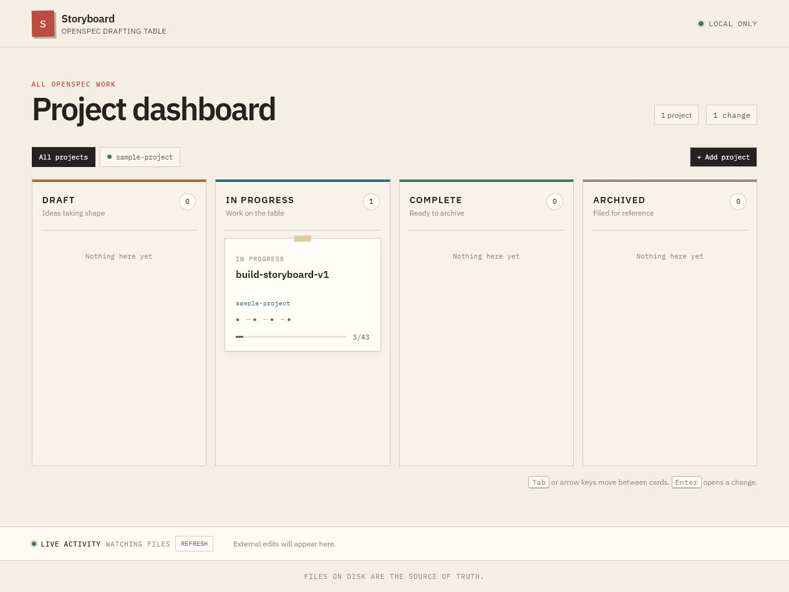
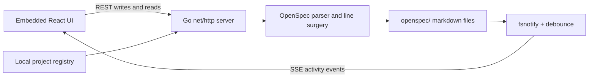

# Storyboard

Storyboard is a local desktop-style board for viewing and safely editing [OpenSpec](https://github.com/Fission-AI/OpenSpec) projects. It turns the markdown already on disk into a lifecycle dashboard, keeps the browser synchronized with external edits, and never introduces a database or cloud service.



## What it does

- Aggregates multiple OpenSpec folders into Draft, In Progress, Complete, and Archived columns.
- Shows artifact availability and task progress for every change.
- Toggles task checkboxes, edits task text, and edits proposals without reformatting untouched markdown.
- Rejects stale writes and reloads the file when another process changed it first.
- Watches projects recursively and streams external changes to every open browser with Server-Sent Events.
- Runs as one local binary with the React application, fonts, and other assets embedded inside it.

Storyboard only listens on `127.0.0.1`. Files on disk remain the source of truth, and the app sends no project data to an external service.

## Run it

Download the binary for your platform from [GitHub Releases](https://github.com/namnhatpham1995/Openspec-storyboard/releases), make it executable on macOS/Linux if necessary, and run it:

```text
storyboard
```

Storyboard chooses an available local port, prints the URL, and opens it in your default browser. Add an OpenSpec project from the first-launch screen, or register one immediately:

```text
storyboard --project /path/to/project
```

Useful options:

```text
--port 4321       Use a specific loopback port instead of an automatic one
--no-open         Print the URL without opening a browser
--config PATH     Use a specific project-registry file
--version         Print the embedded release version
```

The registry contains project paths only. By default it lives in the operating system's user configuration directory under `storyboard/config.json`.

## Architecture



The Go backend is split into small library-first packages:

- `internal/openspec` parses project state and performs byte-preserving, atomic markdown edits.
- `internal/registry` persists and validates local project paths.
- `internal/watch` turns filesystem event bursts into debounced project changes.
- `internal/server` exposes the JSON/SSE API and serves the embedded single-page application.
- `frontend` contains the React, TypeScript, Vite, and TanStack Query interface.

The write path carries a file modification time and SHA-256 hash from read to write. If either no longer matches, the server returns a conflict instead of overwriting newer work.

## Develop

Requirements: Go from [`go.mod`](go.mod) and Node.js 24 or newer.

Run the backend:

```text
go run ./cmd/storyboard --port 8080 --no-open
```

In another terminal, start the Vite development server (it proxies `/api` to port 8080):

```text
cd frontend
npm ci
npm run dev
```

Run all checks:

```text
go test ./...
go vet ./...
cd frontend
npm test
npm run lint
npm run build
```

The production frontend bundle is committed because `go:embed` needs it during a clean Go-only build. CI rebuilds the bundle and fails if the committed output is stale.

## Build and release

Build a local binary and its embedded frontend:

```text
make build
```

Build all supported release targets with a stamped version:

```text
go run ./scripts/release --version v1.0.0
```

Artifacts are written to `dist/` for Windows x64, macOS Intel, macOS Apple Silicon, and Linux x64. A matching native build is executed with `--version` as part of the release command. Pushing a `v*` tag runs native GitHub-hosted builds and publishes their verified artifacts as a GitHub release.

## Scope

Storyboard edits existing changes; it does not replace the OpenSpec CLI for creating, validating, archiving, or applying changes. It has no authentication or remote multi-user mode because the server is intentionally loopback-only.
